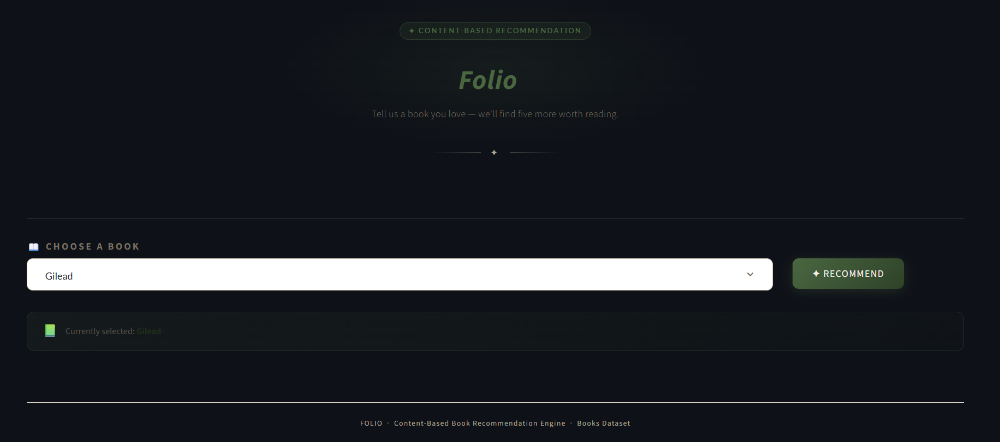
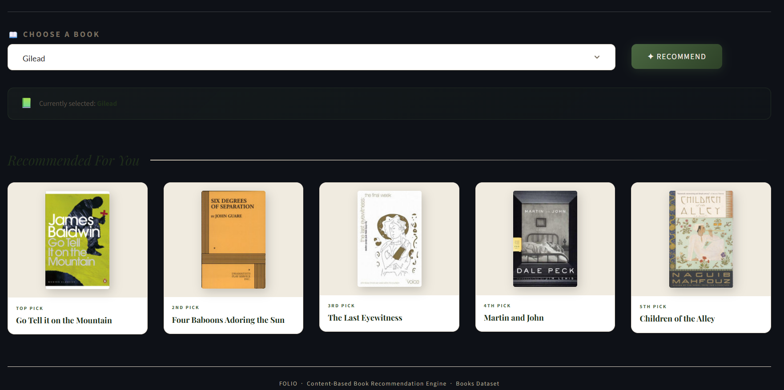

# 📚 Folio - Content-Based Book Recommendation System

[](https://www.python.org/)
[](https://streamlit.io/)
[](https://scikit-learn.org/)
[](https://pandas.pydata.org/)
[](LICENSE)

Folio is a **content-based book recommender** that suggests the top 5 books most similar to a title you already love. It turns book metadata (title, author, category, description) into vectors with `CountVectorizer`, scores similarity with `cosine_similarity`, and serves the results through a custom-styled Streamlit interface with book cover thumbnails.

---

## ✨ Features

- 📖 **Instant recommendations** - pick a book, get the 5 most similar titles
- 🧠 **Content-based filtering** - uses title, author, category, and description text, not user ratings
- 🖼️ **Cover thumbnails** for every recommendation, with a graceful fallback when an image is missing
- 🎨 **Custom editorial UI** - a warm, bookstore-inspired design built with hand-written CSS (Playfair Display + Lato typography) on top of Streamlit
- ⚡ **Cached data loading** (`@st.cache_data`) so the dataset and similarity matrix load once per session

---

## 📸 Screenshots

**Homepage** - pick any book from the dropdown to get started.



**Recommendations** - Folio returns the top 5 most similar titles, ranked with cover art.



---

## 🛠️ Tech Stack

| Layer | Tools |
|---|---|
| Language | Python |
| Data handling | Pandas |
| ML / NLP | scikit-learn (`CountVectorizer`, `cosine_similarity`) |
| Web app | Streamlit |
| Persistence | Pickle (`.pkl`) |

---

## ⚙️ How It Works

**1. Data preprocessing** (`Book_recommendation_train.py`)
The source file `books.xls` is actually comma-delimited text, so it's read with `pandas.read_csv`. Missing values in `title`, `authors`, `categories`, `description`, and `thumbnail` are filled with empty strings, and duplicate titles are dropped.

**2. Tag construction**
A single `tags` column is built by concatenating `title + authors + categories + description`, then lowercased — this is the text the model actually "reads."

**3. Vectorization**
`CountVectorizer(max_features=5000, stop_words='english')` turns each book's tags into a 5,000-dimension bag-of-words vector.

**4. Similarity matrix**
`cosine_similarity` computes pairwise similarity across every book in the dataset, producing a full book × book similarity matrix.

**5. Serving recommendations** (`Book_recommendation_app.py`)
When a user selects a book, the app looks up its row index, pulls its similarity scores against every other book, sorts them in descending order, and returns the top 5 (skipping the book itself, since it's always its own closest match).

---

## 📂 Project Structure

```
book_recommendation_system/
├── Book_recommendation_train.py   # Cleans data, builds tags, trains the vectorizer & similarity matrix
├── Book_recommendation_app.py     # Streamlit app — UI, search, and recommendation display
├── books.xls                      # Raw book metadata (comma-delimited; read as CSV)
├── books.pkl                      # Cleaned dataset, generated by the training script
├── similarity1.pkl                # Book x book cosine similarity matrix, generated by the training script
├── requirements.txt
└── README.md
```

> `books.pkl` and `similarity1.pkl` are build artifacts produced by `Book_recommendation_train.py`. **`similarity1.pkl` is not committed to this repo** (likely too large for plain Git), so you need to run the training script once after cloning before the app will start - see [Installation & Setup](#-installation--setup).

---

## 📊 Dataset

The source data is a books metadata file with the following fields:

`isbn13`, `isbn10`, `title`, `subtitle`, `authors`, `categories`, `thumbnail`, `description`, `published_year`, `average_rating`, `num_pages`, `ratings_count`

Only `title`, `authors`, `categories`, and `description` feed into the recommendation model; the remaining fields (ratings, page count, ISBNs) are carried along in the dataset but not currently used in the similarity calculation.

---

## 🚀 Installation & Setup

### 1. Clone the repository
```bash
git clone https://github.com/Gayathri-Reddy874/book_recommendation_system.git
cd book_recommendation_system
```

### 2. Install dependencies
```bash
pip install -r requirements.txt
```

### 3. Train the model (required — `similarity1.pkl` isn't included in the repo)
```bash
python Book_recommendation_train.py
```
This reads `books.xls`, cleans it, and writes out `books.pkl` and `similarity1.pkl`. The app will throw a `FileNotFoundError` on startup without this step.

### 4. Run the app
```bash
streamlit run Book_recommendation_app.py
```

The app opens at `http://localhost:8501`. Pick a book from the dropdown, click **Recommend**, and Folio returns the 5 closest matches with cover art.

---

## 🧠 Concepts Demonstrated

- Natural Language Processing fundamentals (bag-of-words representation)
- Feature extraction with `CountVectorizer`
- Similarity scoring with cosine similarity
- Content-based recommendation logic (as opposed to collaborative filtering)
- Building and styling a data app with Streamlit

---

## ⚠️ Known Limitations

- **Bag-of-words only** - `CountVectorizer` matches on shared vocabulary, not meaning, so books that are thematically similar but described with different words may be missed.
- **No collaborative signal** - recommendations are based purely on metadata text; user ratings and reading behavior (`average_rating`, `ratings_count`) aren't factored into similarity yet.
- **Static similarity matrix** - adding a new book requires re-running the training script, since the similarity matrix isn't updated incrementally.
- **Thumbnail coverage** - not every book in the source dataset has a thumbnail URL; the app falls back to a placeholder icon in those cases.

---

## 📈 Future Improvements

- Blend in collaborative filtering using `average_rating` and `ratings_count`
- Swap `CountVectorizer` for TF-IDF or sentence embeddings for more meaningful similarity
- Add a "why this recommendation" explanation (shared author/category/keywords)
- Deploy to Streamlit Community Cloud for a live demo link

---

## 👩‍💻 Author

**Mallareddygari Gayathri**

AI/ML Engineer

[GitHub](https://github.com/Gayathri-Reddy874)

---

## 📜 License

This project is licensed under the [MIT License](LICENSE).
